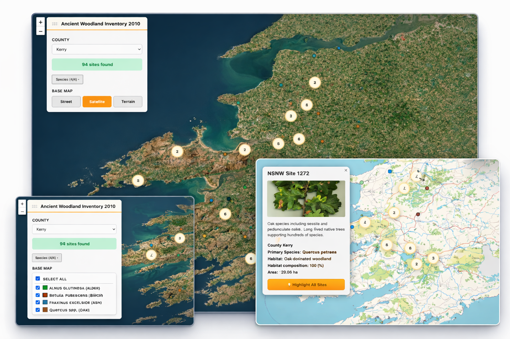

# Native Trees Map

[](https://github.com/kro12/native-trees-react-leaflet/actions/workflows/ci.yml)
[](https://kro12.github.io/native-trees-react-leaflet/)

<p align="center">
  
  <em>Interactive exploration of Ireland’s ancient woodland habitats (Leaflet + React)</em>
</p>

An interactive map-based application for exploring ancient woodland and native tree habitats.  
The project visualises geospatial habitat data, allowing users to filter by county and species, inspect individual sites, and explore data at different zoom levels.

This repository focuses on clarity and maintainability across UI architecture, state management, data handling, and tooling.
It is intentionally engineering-focused (typing, tests, refactoring safety, and code organisation) rather than a polished UI/visual design showcase.

---

## Overview

Native Trees Map is a React + TypeScript application built with Vite and Leaflet.  
It loads habitat data progressively, displays it on an interactive map, and provides multiple ways to explore and interrogate that data:

- County-based filtering
- Species-based filtering
- Marker clustering and polygon rendering at different zoom levels
- Rich popups with contextual habitat information
- Context menus and subtle visual feedback for map interactions

The application is structured to keep domain logic, UI components, and infrastructure concerns clearly separated.

---

## How to Explore the App

For a quick walkthrough:

- Select a **county** to load habitat sites for that area
- Use the **species filter** to narrow results by dominant tree type
- Zoom in to reveal **habitat polygons** and click sites for detailed information

---

## Why I Built This

I wanted to build something that sat between a prototype and a production-ready application.

Mapping and geospatial UIs tend to surface real-world complexity very quickly:
async data loading, large datasets, conditional rendering by zoom level, and tricky third‑party APIs.  
This project was an opportunity to work through those constraints carefully and deliberately, while keeping the codebase readable and testable.

Rather than optimising for novelty, the goal was to optimise for _clarity_:  
clear data flow, explicit state transitions, and tooling that supports change over time.

---

## Key Features

- **Progressive data loading**
  - Lightweight startup index
  - County-level GeoJSON fetched on demand
  - Fast county switching without reloading the full dataset

- **Interactive Leaflet map**
  - Tile layer switching (street, satellite, terrain)
  - Marker clustering at low zoom levels
  - Polygon rendering at higher zoom levels

- **Filtering**
  - County selection
  - Species selection with “select all” behaviour
  - Dynamic site counts based on active filters

- **Progressive disclosure**
  - Markers at low zoom
  - Habitat polygons at higher zoom
  - Visual pulse when entering polygon view

- **Rich UI interactions**
  - Draggable control panel
  - Context menu on map features
  - Detailed popup cards rendered via React portals

- **Robust testing**
  - Unit tests for utilities
  - Component tests for isolated UI logic
  - Integration-style tests for the main App flow, including progressive data loading and disabled UI states

---

## Tech Stack

- **React 18**
- **TypeScript**
- **Vite**
- **Leaflet / react-leaflet**
- **Vitest**
- **React Testing Library**
- **ESLint (flat config)**
- **Prettier**

---

## Project Structure

The structure is intentionally explicit rather than clever:

```
src/
├─ assets/
├─ components/
│  ├─ context_menu.tsx
│  ├─ control_panel.tsx (Presentational component (no logic))
│  ├─ county_zoomer.tsx
│  ├─ detailed_popup_card.tsx
│  ├─ habitat_markers.tsx
│  ├─ map_ref_capture.tsx
│  ├─ species_filter.tsx
│  ├─ zoom_tracker.tsx
│  └─ tests/
│     ├─ control_panel.test.tsx (Component-level UI tests)
│     └─ [other component tests]
├─ hooks/
│  ├─ useContextMenu.tsx
│  ├─ useControlPanelLogic.ts (County loading + filtering logic)
│  └─ useFlashPolygons.tsx
├─ tests/
│  ├─ fixtures/
│  │  └─ habitats.ts
│  └─ App.test.tsx (Integration tests - index + wiring)
├─ constants.ts
├─ utils.ts (loadHabitatData, loadHabitatsForCounty)
├─ utils.test.ts
├─ App.tsx (Loads index, orchestrates map + controls)
├─ main.tsx
└─ index.css
```

---

### Architecture Overview

The application follows a **separation of concerns** approach:

**`App.tsx`** – Application orchestrator

- Loads the habitat **index** on mount (list of counties, species, file paths)
- Wires together map components (MapContainer, TileLayer, GeoJSON, MarkerClusterGroup)
- Manages zoom state and polygon pulse animations
- Handles context menus and popup rendering via React portals
- Delegates control panel logic to `useControlPanelLogic`

**`useControlPanelLogic`** – Control panel state & data loading hook

- **County habitat loading**: fetches GeoJSON for selected county on demand
- Filtering logic (county selection, species filtering)
- Base layer selection (street/satellite/terrain)
- Panel UI state (position, dragging, dropdown visibility)
- Flash/highlight animations for polygons
- Returns a stable API consumed by `ControlPanel`

**`ControlPanel`** – Pure presentational component

- Renders county selector, species filter, base layer buttons, site counts
- Receives all state and handlers via `controlPanel` prop
- No data fetching or business logic
- Fully testable in isolation with mocked `controlPanel` data

This separation keeps responsibilities clear:

- `App` owns **application-level data** (index loading, map orchestration)
- `useControlPanelLogic` owns **control panel domain logic** (county data loading, filtering, panel state)
- `ControlPanel` owns **presentation only** (rendering UI based on provided state)

**Notes:**

- `constants.ts` contains shared domain types and configuration.
- `utils.ts` holds pure data/logic helpers (loading functions, styling, colors).
- Test fixtures live alongside tests but remain strongly typed.
- Leaflet-specific behaviour is isolated to keep React components predictable.

---

## Testing Strategy

Testing follows the application's architecture layers:

**Unit tests**

- Pure utilities and data transformation logic (`utils.test.ts`)
- No mocking required – just inputs and outputs

**Component tests**

- `ControlPanel` UI logic in isolation
- Tests user interactions (county selection, species filtering, base layer switching)
- Mocks `useControlPanelLogic` to provide controlled state

**Integration tests**

- App-level orchestration tests (`App.test.tsx`)
- Verifies map wiring and component composition
- Tests that `App` correctly uses `useControlPanelLogic`
- Mocks Leaflet/react-leaflet to avoid testing third-party library internals

**What we DON'T test:**

- Leaflet's internal rendering behavior
- Third-party clustering algorithms
- Browser geospatial APIs

This layered approach keeps tests fast, focused, and resilient to refactoring.

The project uses a lightweight GitHub Actions workflow to ensure formatting, linting, type safety, tests, and builds remain green.

---

## Data Loading Strategy

The original NSNW dataset is relatively large (~14 MB as a single GeoJSON file).  
To keep initial load times fast and interactions responsive, the application uses a **two-phase loading approach**:

### Two-phase data loading

**Phase 1: Index (App responsibility)**

- Loads on mount: list of counties, species, file paths
- Lightweight (~2-5KB)
- Required before control panel can function
- This keeps the initial render fast and predictable

**Phase 2: County habitats (useControlPanelLogic responsibility)**

- Loads when user selects a county
- Per-county GeoJSON files (~0.5-1.3 MB each)
- Only fetches what's needed
- Typical file sizes enable fast county switching

This separation is architectural:

- `App` owns application-level bootstrap data
- `useControlPanelLogic` owns user-triggered data fetching

This approach avoids downloading unused data, improves perceived performance, and scales cleanly if additional datasets are introduced later.

Loading state is visualised inline through small UI changes (disabled controls and status text) rather than a blocking full-screen overlay, reflecting the relatively small per-county payload sizes and prioritising visual continuity during interaction.

---

### Bundle analysis & code splitting

Leaflet and its React bindings account for a significant portion of the production bundle size.

During development, the build was analysed using `rollup-plugin-visualizer` to understand bundle composition. Based on this, an optional manual chunk is defined for Leaflet-related dependencies:

```ts
manualChunks: {
  leaflet: ['leaflet', 'react-leaflet', 'react-leaflet-cluster'],
}
```

---

## Development

### Install dependencies

```bash
npm install
```

### Run the dev server

```bash
npm run dev
```

### Run tests

```bash
npm run test
```

### Lint & typecheck

```bash
npm run lint
npm run typecheck
```

### Production build

```bash
npm run build
```

---

## Notes on Tooling

This project uses:

- ESLint **flat config**
- Multiple TypeScript configs for app, tests, and tooling

That separation is intentional and helps keep editor feedback, tests, and builds aligned without overloading a single config.

---

## Future Improvements

- Heatmap visualisation of species density or habitat concentration
- Time‑based layers to compare historical woodland coverage
- Improved accessibility for map controls
- Server-side preprocessing or hosting of county-level datasets
- Optional hosted demo

---

## Data Source

The spatial data used in this project is derived from the **National Survey of Native Woodlands (NSNW)** dataset published by the Irish **National Parks & Wildlife Service**.

- **Dataset**: _NSNW Woodland Habitats 2010_
- **Original format**: ESRI Shapefile (`.shp`, `.dbf`, `.shx`, etc.)
- **Reference document**: _National Survey of Native Woodlands 2003–2008_

The original shapefile data was converted to **GeoJSON** for use in a web‑mapping context.  
Conversion was performed using an online GIS conversion tool prior to ingestion into the application.

The application does not modify or reinterpret the underlying dataset beyond format conversion and client‑side filtering.

---

## Testing

The project includes both unit and integration tests:

- Component‑level unit tests
- Full App integration tests with mocked Leaflet and map primitives
- Typed fixtures shared across tests to ensure consistency with domain models

Tests are designed to verify real user flows rather than implementation details.

Run tests with:

```bash
npm run test
```

---

## CI

A GitHub Actions workflow runs on every push to:

- Check formatting
- Run ESLint
- Type-check the project
- Execute the test suite
- Build the app

This keeps the repository in a consistently healthy state even as dependencies or tooling evolve.
The CI pipeline mirrors local development scripts to ensure behaviour is consistent across environments.

---

## Optional bundle analysis

For occasional performance exploration, the repo includes **optional build visualisation** using `rollup-plugin-visualizer`.

When enabled, it generates a treemap showing which dependencies contribute most to bundle size.  
This is **disabled by default** and intended as a learning and inspection tool rather than production setup.

---

## Why I Built This

I wanted to explore the intersection of **frontend engineering**, **geospatial data**, and **real‑world datasets**.

Mapping applications introduce a unique set of challenges, asynchronous data loading, imperative APIs, spatial performance concerns, and complex UI state. This project was an opportunity to design a clean React architecture around those constraints while keeping the codebase well‑typed, testable, and maintainable.

The subject matter, Ireland’s native woodlands, also made it a rewarding dataset to work with and explore.

---

## License

This project is provided for educational and demonstration purposes.  
Dataset ownership and attribution remain with the National Parks & Wildlife Service.
